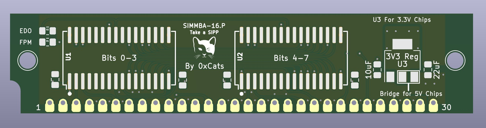
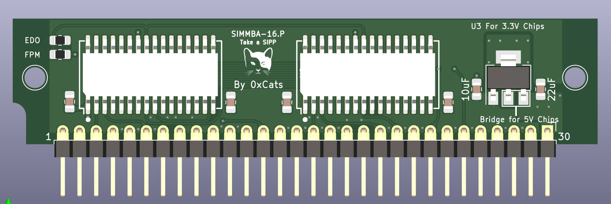
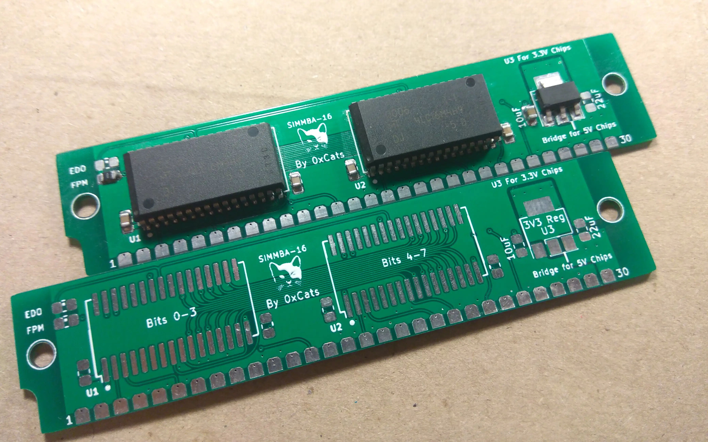
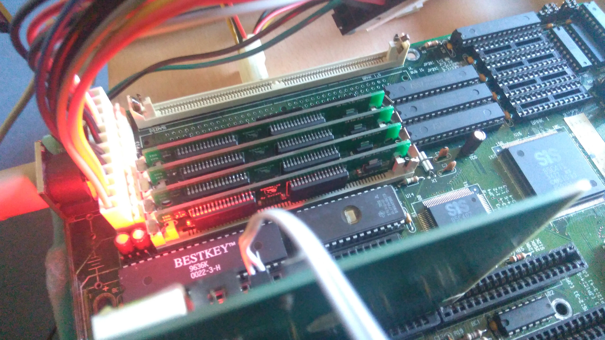

# SIMMBA-16. P
Open-source 30 pins 16MB SIMM memory module

## Status Updates
* 2022-06-12
* Version 1A assembled and tested [link](https://twitter.com/0xCats/status/1524708654913662977)
  * Many months of happily using rev A1 board
* 2022-11-22
  * Version 2A released to the public

# Just gimme the Gerbers!
[gerber.zip](https://raw.githubusercontent.com/rigred/SIMMBA-16/main/production/gerber.zip)

# Why?
Because I have a 486 motherboard that I'm quite fond of that featured a mix of 2x72pin and 4x30pin SIMM sockets.
I wanted to use both at maximum capacity. Also 30 pin SIMM memory prices are not great.

# What is this thing?
A 16MB(the absolute limit) 30 pin SIMM/SIPP Memory module for various PC compatibles.
This board was designed to be as low cost and simple as possible and supports flexibility in ram chip and socket selection.

## Supported RAM chips

3.3V chips may be relatively easily found from cheaply available 256MB EDO DIMM's.
These are by far the preferred choice in comparison to the now rarer 5V chips.
I have tested and validated some of the below chips and found them to be 5V IO tolerant in use despite manufacturer data sheets not directly ascribing such.
Of these the Micron chips are by far the most common and robust. All others have been data sheet checked to be electrically compatible.
## (3.3V)
 * MT4LC16M4H9 (Preferred, Tested & Validated)
 * GM71V65403C (Tested)
 * K4F640412C (Validated)
 * KM44V16104BK (Validated)
## (5V)
 * KM44C16100BK
 * K4E660411C
 * K4F640411B

# Assembly

## Bill of Materials

[HTML BOM](https://htmlpreview.github.io/?https://raw.githubusercontent.com/rigred/SIMMBA-16/main/bom/ibom.html)

## RAM Salvaging
If you are not using new-old-stock chips and are instead salvaging compatible chips form DRAM Modules then I recommend you take the utmost care in desoldering such.
* If possible test your source RAM boards before salvaging, you do not want to be taking risks with unknown quality chips.
* It is very easy to overheat and destroy these old DRAM chips, use a preheater and hot air station or temperature controlled reflow oven to remove the chips
* If you have not done this before, expect mysery pain and failure, but don't give up.
* I bear absolutely no responsibility for any of this should it go horribly wrong.

## Voltage selection
When 3.3V chips are used it is required to install a suitable 3.3V LDO regulator such as the common AMS1117-3.3 as well as the 10uF Capacitor
When 5V chips are used you must bridge the indicated pads with a 0-Ohm resistor or suitable piece of metal and install the 22uF Capacitor
_DO NOT_ install the 3.3V Regulator when using 5V chips and bridging the indicated pads.

## EDO / FPM selection
For the most part only the FPM bridge should be populated. In this mode the CAS signal is tied to the Output Enable signal pin of the chips.
On EDO DRAM chips this forces the output buffers to become invalid and cleared as soon as the CAS is toggled and allows EDO chips to behave like FPM chips.
In rare cases you may want to configure this module as EDO mode, such as in use with 72pin to 4x30pin SIMM-Saver/SIMM-Expander boards.

## SIPP mode
If you wish to use these as SIPP modules, in case say your SIMM sockets are broken, or you've found some very obscure motherboard that both supports SIPP memory and this size of module. Then you can simply solder a right angle 100mil/2.54mm header to the holes along the edge.

# Soldering
* For repeatable good results when soldering the ram chips in place it is recommended to use a stencil and soldering paste and soldering the whole board in one pass on a hot plate.
* Hand soldering is possible but great care must be taken to ensure good contact on the pads and no solder bridging. *Large quantities of flux recommended.*

# Troubleshooting

1) If you are using the 3.3V regulator design and are experiencing voltage instability it may be necessary to adjust the capacitance of the 5V input and 3.3V output filter capacitors.
 * In this design, less can often be better.

2) After assembly it is recommended to first power test and check your handiwork in expectation of failure. Feel for any hot parts on the DRAM

3) If you are getting memory errors there is a good chance that either some pins are not making good contact or you've overheated one of the chips.

4) Mixing and matching these modules with other modules in the same bank is _NOT_ supported nor recommended.

# Revision A1 testing

The A1 revision SIMMBA module assembled

64MB of SIMMBA A1 revision under test

